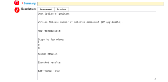

# Red Hat Relationship

Landing code in the OpenShift release is just one part of the integration
journey. Once the initial work of integrating a new infrastructure platform
is complete, there is extended task of maintainance and feature improvement.

Depending on the depth of the partner agreement with Red Hat, it is
reasonable to expect that there will be continuing work in the form of bug
fixes and continued maintenance. In some cases, due to timing, it is possible
that the initial work which lands in the release payload will need further
engineering to reach the expected feature parity.

## Open source

All components that are released by Red Hat are built using [open source][oss]
development practices. As such, the components that are included in
OpenShift Container Platform releases will have their source code stored in
a publicly accessible location (usually the
[OpenShift GitHub organization][github]).

The open source development model encourages collaboration from the community
of users who operate and utilize the software. This means that bugs can be
reported by anyone, and likewise solutions can also be proposed by anyone in
the community.

The components that you build for OpenShift will be released as open source
software. Once they are released, you have the opportunity to create fixes
collaboratively and transparently with the community. This is a core principle
to the continuing relationship with Red Hat and the wider user community.

## Bugzilla

Red Hat uses [Bugzilla][bugzilla] as the primary point of interaction for
reporting and tracking defects. Red Hat is also in the process if mirroring
bugs from Bugzilla into a public [Jira][jira] instance as well. In the
future, Jira may become the primary interface, but for today you will need
to use Bugzilla.

### Bugzilla workflow

Bugs within Red Hat's bugzilla contain a state that indicates their current
status. In general these states should flow from top to the bottom of the
list following this paragraph. Engineers should never move bugs further down
than MODIFIED state.

**Bug States**

* NEW - only bugzillas with insufficient information (no reproducer, missing
  information from customer) and bugzillas where it is not sure who will take
  care of them (more people involved on the component) should be in this state.

* ASSIGNED - the most common bugzilla status, someone is assigned to the
  bugzilla and has enough information to further investigate and resolve the issue.

* POST - a patch or solution believed to resolve this matter has been proposed
  (POSTed) for inclusion to the appropriate git repo.

* MODIFIED - fix is in git, but was not tested yet and not released for users.
  The appropriate code repo has been MODIFIED with the fix. (This is the last
  state engineers should use.) If your PR properly linked to the BZ this should
  happen automatically.

* ON_QA - QA is looking at the fix. If it fails QA they will move it back to
  ASSIGNED. The 'automated release' team is responsible to move bugs from
  MODIFIED to ON_QA when the fix is available in a nightly build for testing.

* VERIFIED - QA tested the bugzilla and the bug seems to be fixed.

* RELEASE_PENDING - An errata was fully tested and the bug will get closed
  automatically once the images are publicly available.

* CLOSED - bugzilla is resolved, no further actions are needed (refer to
  [bugzilla statuses][bz-statuses] for all variants of CLOSED).

###  Reporting an OpenShift bug

To report a new OpenShift bug, navigate to the [Bugzilla][bugzilla] webpage
and file the bug by selecting "New", then "Red Hat", then "OpenShift
Container Platform". The following link is a shortcut to create a new bug for
the OpenShift Container Platform:

[New Bug for OpenShift Container Platform][new-bug-link]

There are several fields to note when creating a new bug. The next few images
will highlight the fields you need to fill.

**Bugzilla Field Descriptions**

1. Component is the OpenShift component to which the bug is being reported, for
  example Installer, or Cloud Compute. Choose the component which best fits
  the bug. Do not worry if you don't see an exact match for your component,
  choose the closest match and then during triage the bug will be re-assigned
  if necessary. If you know the GitHub repository of the component you are
  creating a bug against, you can look in the `OWNERS` file in the root of the
  repository to see the component information.

2. Version is the OpenShift version against which this bug is being reported.
  By default this field will contain the version that is being released next.
  If reporting a bug to a previously released version of OpenShift, select that
  version.

3. Target Release is the OpenShift version for which a solution is being
  proposed. This is used by Red Hat to indicate when engineering intends to
  fix a bug. It does not need to be set when creating a new bug.

4. Severity is the impact that this bug has on OpenShift. You should set this
  field based on the nature of the bug as follows:

    * Urgent - Causing a breakage/outage/unrecoverable issue.
    * High - Blocking functionality from succeeding.
    * Medium - Impacts functionality but critical operations remain functional
      or occurs under specific circumstances.
    * Low - Everything else.

5. Priority is set by Red Hat as a guideline for how the bug should be
  evaluated and planned. Priority should not be adjusted by anyone other than
  Red Hat component team members.

6. Summary is a concise description of the bug. This is most frequently what
  users will see when searching for issues, so it should contain some high
  level identification of underlying problem.

7. Description is where the bug will be described in greater detail. The
  template text in this field will guide you in creating content for the bug.

### New components in Bugzilla

When adding new components to OpenShift, for example a new cloud controller
manager, the new component will need to be added to Bugzilla by Red Hat team
members. After you have completed the process of adding your repository to
the OpenShift organization on GitHub and have created the necessary Prow
configuration files in the OpenShift Release repository, your component should
be added to Bugzilla. If you have completed these steps and do not see your
component in Bugzilla, please reach out to your Red Hat contacts.

[bugzilla]: https://bugzilla.redhat.com
[jira]: https://issues.redhat.com
[new-bug-link]: https://bugzilla.redhat.com/enter_bug.cgi?product=OpenShift%20Container%20Platform
[bz-statuses]: https://bugzilla.redhat.com/page.cgi?id=fields.html#status
[oss]: https://www.redhat.com/en/topics/open-source/what-is-open-source
[github]: https://github.com/openshift
